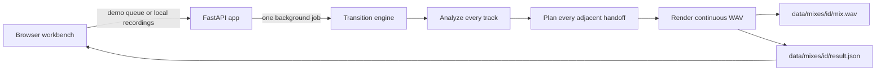
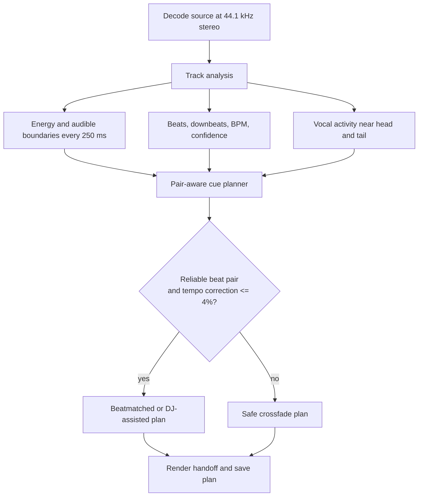
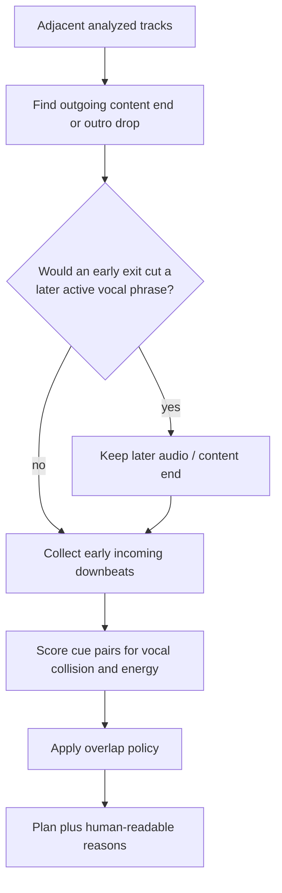
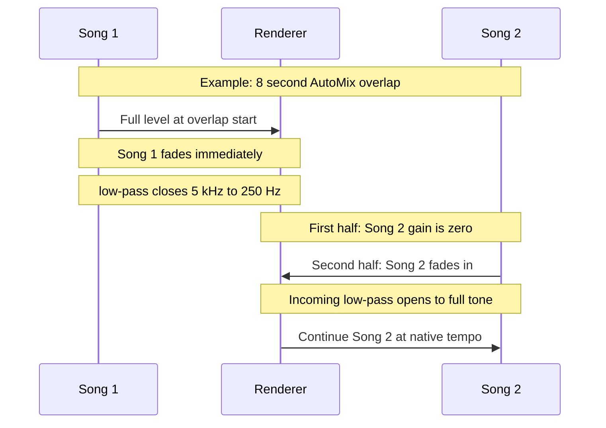

# AutoMix Lab

AutoMix Lab is a local, offline workbench for making a musical transition between recordings you are allowed to use. Put 2–6 tracks in a fixed order, then the engine analyzes each adjacent pair, chooses an exit cue for Song 1 and an entry cue for Song 2, renders the handoff, and saves an inspectable plan beside the WAV.

It is a **transition engine**, not a recommendation engine or streaming player. The goal is not to guess what song comes next; it is to make the songs the listener supplied connect more naturally.

## Start the app

Install Docker Desktop, open a terminal in this directory, and run:

```sh
docker compose up --build
```

Open [http://127.0.0.1:8765](http://127.0.0.1:8765).

The first analysis downloads pinned Beat This! and UMX-HQ weights into local `data/`. Docker provides Python and every dependency, so no host Python installation is needed. Stop the server without removing saved work:

```sh
docker compose stop
```

## Use it

1. Select **Build demo mix** to download the licensed demo tracks, or **Add audio** to choose 2–6 MP3, WAV, or FLAC files. File-picker order is queue order.
2. Build **AutoMix**. The UI polls a background job while analysis, planning, and rendering run.
3. Switch to **Plain crossfade** to compare the same queue without the AutoMix decisions.
4. Use **Hear transition** to audition a handoff from four seconds before its start.
5. Inspect or download the WAV and **Mix plan**.

Uploads must be mono/stereo, 2 seconds–10 minutes, 8–192 kHz, and at most 100 MB per file. The server binds only to loopback.

## Architecture



There is one render worker and at most three pending jobs. That is deliberate for a local workbench: full-song beat and vocal analysis should not saturate a laptop with several concurrent queues.

## How a transition is made

For every adjacent pair, the engine follows this pipeline:



### 1. Decode consistently

`engine.decode()` reads source audio, rejects unsupported channels or non-finite samples, resamples to **44.1 kHz**, and expands mono to stereo. Every cue, filter, beat position, and output sample therefore shares one timeline.

Outside a transition and its possible reverb tail, the output uses the original decoded samples. The renderer does not unnecessarily process an entire track.

### 2. Analyze each track once

`engine.analyze()` stores a SHA-256/version-keyed result in `data/analysis/`, so repeat mixes reuse expensive track evidence.

| Evidence | Measurement | Used for |
| --- | --- | --- |
| Energy curve | RMS at 250 ms intervals across the whole track | Audible bounds, energy changes, outgoing outro candidates, incoming rises |
| Audible bounds | Energy above a floor derived from the track itself | Avoids treating silence as music |
| Outro candidates | Final energy drop that does not recover to a strong section | Finds a plausible early exit |
| Beat grid | Beat This! small0: beats, downbeats, BPM, confidence | Alignment and limited tempo correction |
| Vocal activity | UMX-HQ source separation in first/last 30 seconds | Avoids vocal collisions and protects late singing |
| Heuristic fallback | Voice-band spectral activity | Cue ranking only when model inference is unavailable |

The model is intentionally conservative: an unscanned middle section is **unknown**, not assumed vocal-free. If the vocal model cannot run, the plan labels the fallback and a later run retries the real model instead of caching failure permanently.

### 3. Choose exit and entry together

`engine.plan_transition(a, b, mode)` scores a **pair** of cues. It does not separately pick “the best ending” and “the best beginning,” because a good cue in isolation can still create two simultaneous vocal lines.



#### Outgoing cue policy

1. Start from the audible/content ending.
2. Consider an earlier exit only when a sustained final energy decline does not recover into a strong section.
3. Never discard more than **12 seconds of measured audible music** after an early exit.
4. When model evidence covers the region, preserve a later sustained vocal phrase. A short immediate vocal decay is allowed; a later return is not.
5. With a dependable grid, move the overlap start to a nearby downbeat only if the same safety rules still hold.

#### Incoming cue policy

For beat-aware plans, the engine considers downbeats near the audible beginning of Song 2 (the first 12 seconds). It favors a cue with an energy rise and less vocal activity through the proposed overlap. That is how it can choose an instrumental/downbeat entry instead of blindly starting from sample zero.

Weak BPM, missing downbeats, unusual tempo, or short material selects a safe crossfade. The engine does not claim beat precision it cannot support.

#### Transition length

AutoMix has a **7 second minimum** whenever both selected source regions contain at least 7 seconds of usable audio. Structural/tempo evidence may choose longer overlaps up to **12 seconds**. Vocal conflict handling cannot shorten AutoMix under that floor; it uses complementary ducking where evidence supports it.

For physically short material, the plan uses the longest possible overlap and explicitly explains the exception. Plain crossfade remains a simpler 6 second reference, shortened only when a tiny source makes that impossible.

### 4. Render the handoff

`engine.render_mix()` processes the queue left-to-right. It tracks source/output offsets so later transitions refer to the right portion of a track that was already introduced in an earlier overlap.



```text
overlap progress       0%                 50%                 100%
Song 1 gain            full ────────╲────────────────────────── 0
Song 1 tone            dry → low-pass closing to 250 Hz
Song 2 gain             0 ─────────── 0 ────────────────╱──── full
Song 2 tone            silent          low-pass entry → full tone
```

For eligible AutoMix tiers:

- Song 1 uses an equal-power fade from the first overlap sample. Its low-pass closes from 5 kHz to 250 Hz; a 150 ms dry-to-filter ramp avoids a hard timbre jump.
- Song 2 is silent for the first half. In the second half it rises under a low-pass, entering around 1.4 kHz at midpoint and opening to full tone by the end.
- Beatmatched/DJ-assisted plans exchange low frequencies around a planned bass handoff.
- Unavoidable model-detected vocal collision can apply complementary vocal-band ducking, capped at 6 dB.
- A safe, beat-supported structural outro may add a 20%-wet stereo convolution reverb tail. Reverb is separate from the filter sweeps.
- WSOLA is used only for an eligible small tempo adjustment, then ramps back to native tempo after the overlap.
- One global attenuation pass limits the final output to **−1 dBFS sample peak**.

### AutoMix versus Plain crossfade

| Behavior | AutoMix | Plain crossfade |
| --- | --- | --- |
| Cue selection | Structural exit + pair-scored incoming cue | Track endings and beginnings |
| Length | 7–12 seconds where possible | 6 seconds, shorter for tiny files |
| Beat alignment / WSOLA | Evidence-gated | Never |
| Filters, bass handoff, vocal duck | Eligible tiers only | No |
| Structural reverb | Eligible outro only | No |

Plain mode is not a failure path. It is the reference listeners use to decide whether the additional transition logic helped a specific pair.

## Output and mix plan

Each job creates `data/mixes/<mix-id>/`:

```text
sources.json  queue metadata and local source paths
mix.wav       rendered 24-bit PCM stereo audio
plan.json     transition decisions, waveform, and track analysis
result.json   plan plus job id, timestamp, and playlist key for the UI
```

A transition entry contains values such as:

```json
{
  "tier": "dj-assisted",
  "outgoing_start": 212.07,
  "outgoing_end": 220.07,
  "incoming_cue": 2.0,
  "overlap_seconds": 8.0,
  "mix_out_type": "sustained_outro_drop",
  "vocal_evidence": "model",
  "vocal_duck_db": 2.5,
  "reverb_wet": 0.2,
  "reasons": ["human-readable planning evidence"]
}
```

Times are seconds of the source recording unless a field begins with `timeline_`, which is measured in the rendered WAV. `source_resume` and `output_resume` describe the WSOLA-to-native-tempo mapping used for later handoffs.

## Directory structure

```text
AutoMix-Lab/
├── app.py                    FastAPI server, validation, jobs, and local API
├── engine.py                 Decode, analysis, planning, DSP, and WAV renderer
├── vocal_model.py            Pinned UMX-HQ download, verification, and inference
├── demo_tracks.json          Demo metadata, source URLs, and SHA-256 checksums
├── docker-compose.yml        Local service plus persistent ./data mount
├── Dockerfile                Reproducible Python/CPU-model runtime image
├── requirements.txt          Pinned Python dependencies
├── static/
│   ├── index.html            Workbench layout
│   ├── app.js                Queue, polling, playback, waveform, and inspector
│   └── style.css             Responsive workbench styles
├── tests/
│   ├── test_api.py           Validation, jobs, range responses, and persistence
│   ├── test_engine.py        Planner, DSP, rendering, timeline, and safety tests
│   └── test_vocal_model.py   Vocal-model file and inference contract tests
├── data/                     Local runtime state; ignored by Git
│   ├── tracks/               Verified demo downloads
│   ├── uploads/              User-provided recordings
│   ├── analysis/             SHA-256/version-keyed analysis cache
│   ├── models/umx-hq/        Downloaded vocal model
│   ├── mixes/<mix-id>/       WAV, plans, sources, and results
│   ├── jobs/                 Persisted public job state
│   └── docs/                 Preserved local historical verification records
└── THIRD_PARTY_NOTICES.md    Dependency, model, demo-audio, and inspiration provenance
```

`data/` is ignored by Git. Deleting it removes cached models, imports, and renders; the app does not delete original source files outside the project.

## Local API

| Route | Purpose |
| --- | --- |
| `GET /api/health` | Health check |
| `GET /api/demo-tracks` | Demo metadata and local availability |
| `POST /api/demo-tracks/download` | Start verified demo download |
| `POST /api/mixes` | Submit a demo queue, uploads, or saved sources for rendering |
| `GET /api/jobs/{id}` | Poll job progress |
| `GET /api/mixes/{id}` | Read a completed result |
| `GET /api/mixes/{id}/audio` | Stream WAV with range support |
| `GET /api/mixes/{id}/plan` | Download the plan |
| `GET /api/latest` | Restore latest AutoMix/Plain pair for the playlist |

## Develop and verify

Run the test suite in the same Docker image used by the app:

```sh
docker compose run --rm automix python -m unittest discover -s tests -q
node --check static/app.js
```

Synthetic audio tests verify mechanical behavior that ears alone cannot: cue safety, the 7 second floor, no incoming signal before midpoint, filter sweeps, vocal collision policy, clipping protection, and timeline continuity. Listening to real pairs is still required to judge musical quality.

When improving the transition engine:

1. Reproduce a bad pair and export its plan.
2. Identify whether the failure is exit selection, incoming entry, beat evidence, vocal evidence, or render shaping.
3. Add the smallest regression test that proves the failure.
4. Change the shared planner or renderer, rebuild, and compare AutoMix with Plain crossfade.

## Scope and limits

- Queue order is user-supplied. No next-song recommendation is implemented.
- UMX-HQ activity is source-separation evidence, not lyric transcription or a perfect singer-onset detector.
- Beats can be wrong on live material, tempo changes, sparse percussion, or unusual meters; the planner then falls back.
- The engine does not infer full musical phrases or harmonic key.
- WSOLA is deliberately limited and can still produce artifacts on unsuitable material.
- The output ceiling is sample peak, not true peak or loudness normalization.
- Audio is decoded into memory, so this is designed for small local queues. Chunked rendering is the future path for long recordings.

## Rights and provenance

See [THIRD_PARTY_NOTICES.md](THIRD_PARTY_NOTICES.md) for dependency licenses, model provenance, BitChord inspiration disclosure, and demo-recording attribution. Only process and distribute recordings you have the right to use.
